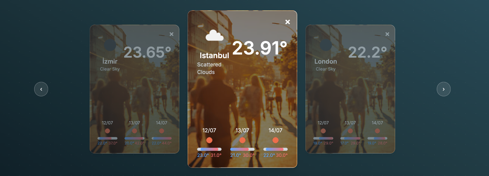

# 🌤️ Weather App

A beautifully designed weather dashboard built with **Flask**, where users can track multiple cities, view live forecasts, and receive scheduled daily emails with the weather reports.

🌐 **Live App:** [weather-app-zi2i.onrender.com](https://weather-app-zi2i.onrender.com/)



## 🚀 Features

- 🧑‍💼 **User Authentication** — Register and login securely
- 🏙️ **City Management** — Add or remove multiple cities to your personal dashboard
- 📅 **3-Day Forecast** — Visual forecast for each city with temperature bars
- 📧 **Daily Email Notifications** — Users can select a preferred hour to receive weather reports
- 🖼️ **Dynamic Backgrounds** — Local images shown based on temperature range
- 🕒 **Cron Job Integration** — Email system uses `APScheduler` for scheduled delivery
- ☁️ **OpenWeatherMap Integration** — Live weather and forecast data

## 🛠️ Tech Stack

- **Backend:** Flask, SQLAlchemy, APScheduler, Flask-Mail
- **Frontend:** HTML, CSS (Tailwindcss), JavaScript
- **Database:** SQLite
- **Deployment:** Render

## 🖼️ UI Preview

The dashboard displays each city's weather in a modern carousel style:


## ⚙️ Installation

1. Clone the repository:
    ```bash
    git clone https://github.com/yourusername/weather-app.git
    cd weather-app
    ```

2. Install dependencies:
    ```bash
    pip install -r requirements.txt
    ```

3. Add a `.env` file with the following contents:
    ```env
    SECRET_KEY=your_secret_key
    MAIL_USERNAME=your_email@gmail.com
    MAIL_PASSWORD=your_email_password
    OPENWEATHER_ACCESS_KEY=your_openweathermap_api_key
    ```

4. Run the application locally:
    ```bash
    python app.py
    ```

## 🛰️ Deployment (Render)

- Automatically deploys via GitHub
- Scheduler runs in the background to send daily emails
- Handles graceful shutdown to avoid `SchedulerNotRunningError`
- Uses `.env` secrets for secure configuration

## 📄 License

This project is open-source and available under the MIT License.

---

> Built with ❤️ by [Benhur Okur](https://github.com/benhur-okur)